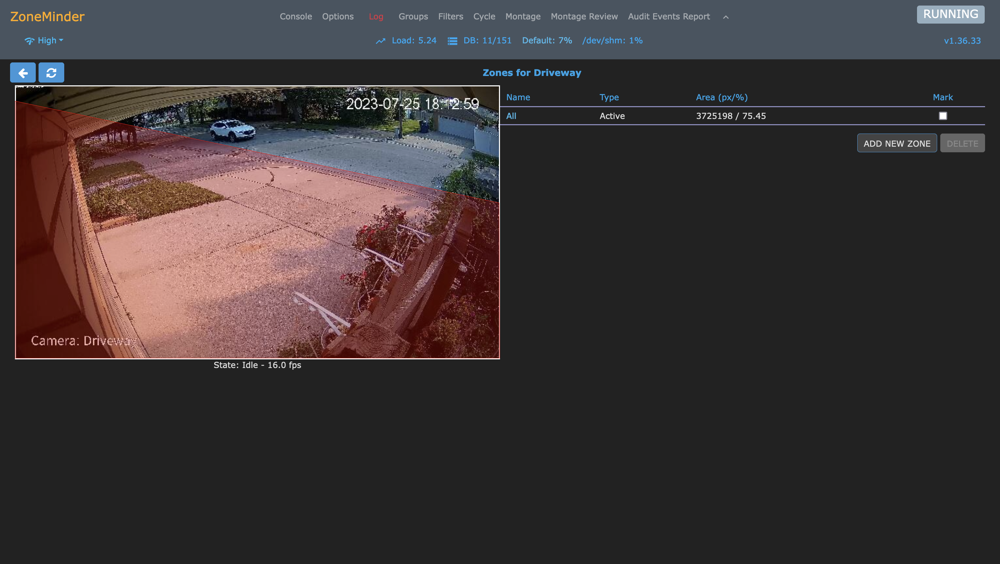
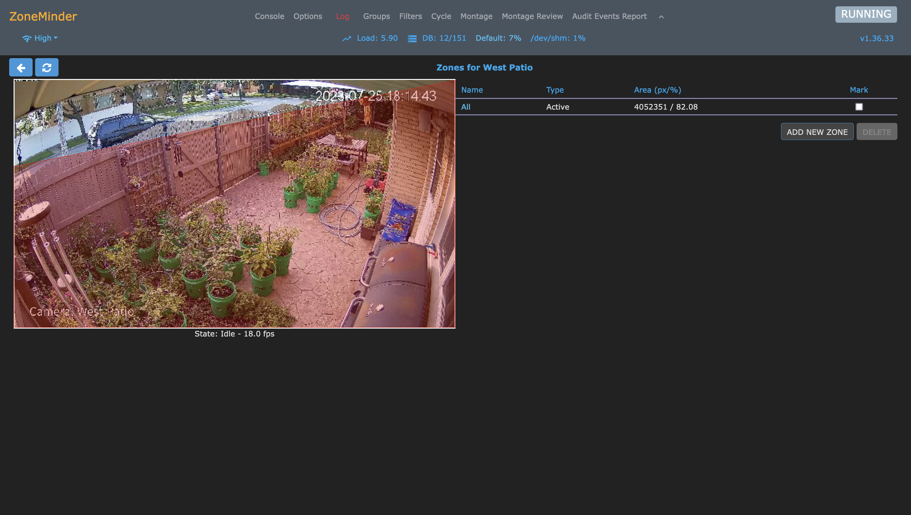

# Deploying a Video Security System Using ZoneMinder on Ubuntu Linux

### Tom Dean: [LinkedIn](https://www.linkedin.com/in/tomdeanjr/)

## Introduction

When we moved into our house five years ago...

In this tutorial, I'm not going to provide a step-by-step guide, because of the many variables, including cameras, house construction and technical concerns.  I will point out the high-level considerations, where I ran into issues and will document any resources I used for the project in this repository.

***Let's go!***

## Resources

[ZoneMinder](https://zoneminder.com/)

[ZoneMinder Documentation](https://zoneminder.readthedocs.io/en/stable/)

[ZoneMinder Documentation: Installation Guide](https://zoneminder.readthedocs.io/en/stable/installationguide/index.html)

## High-Level Thinking

### Hardware

#### ZoneMinder Server

I started with a **Dell Precision T3500** workstation that I use as a general-purpose server in my lab:

- Ubuntu 22.04
- Single six-core Xeon processor
- Plenty of storage
    - RAID-1 HDD for system: 1TB
    - RAID-1 HDD for data: 3TB
- Dual 1GB network connections
    - Public/General network
    - Private/Data/Application Network
- 24GB of RAM

I experimented with this server for a day, and ran into performance issues.  The server ran out of RAM and went into swap, and I had pretty significant iowaits, which caused significant impact to performance.  I wasn't happy with this setup, so I configured a new instance of ZoneMinder on another more powerful machine in my lab.

I have a **Dell Precision T5500** workstation sitting under my desk, which I recently upgraded:

- Ubuntu 22.04
- Dual six-core Xeons
- Plenty of storage
    - RAID-1 SSD for system: 250GB
    - RAID-1 HDD for data: 6TB
- Dual 1GB network connections
    - Public/General network
    - Private/Data/Application Network
- 72GB of RAM
- Decent GPU, possible future use?

The workstation was already up and running with Ubuntu 22.04, mostly idle, serving as an development server.  Yes, it's kind of old, but it's still a trooper, like me.

#### Security Cameras

[Amazon: Amcrest 5MP AI Turret IP PoE Camera w/ 49ft Nightvision](https://www.amazon.com/dp/B0BNM2SGPS)

[Amazon: Amcrest UltraHD 4K (8MP) Outdoor Security POE IP Camera, 3840x2160, 98ft NightVision](https://www.amazon.com/dp/B077Y52782)

[Amazon: Amcrest Store](https://www.amazon.com/stores/Amcrest/page/2404E471-79FC-4D18-B767-8777D048264F)

[Amazon: Amcrest NV4108E-A2 4K 8CH POE NVR (1080p/3MP/4MP/5MP/8MP) POE Network Video Recorder](https://www.amazon.com/Amcrest-NV4108E-HS-1080p-Network-Recorder/dp/B0743WP62Q)

[Amazon: TP-Link TL-SG1005P 5 Port Gigabit PoE Switch 4 PoE+ Ports @65W](https://www.amazon.com/dp/B076HZFY3F)

### NVR Software: ZoneMinder

[ZoneMinder](https://zoneminder.com/)

I've been researching this project for a couple of years, and had set up ZoneMinder in the past, but never moved to the "installing cameras" part of the project.

***Let's see how we build that!***

## Install ZoneMinder Software

[ZoneMinder Documentation: Installation Guide](https://zoneminder.readthedocs.io/en/stable/installationguide/index.html)

## Perform a Site Survey: Not Optional!

## Cameras: Physical Installation/Wiring

## Configure Cameras on the Network

General Network Considerations:

- Camera IP Addresses
    - Static IP or Reserved DHCP IP Addresses
- DNS: Forward and Reverse
    - Optional, but a good idea if you can
    - Makes setup, configuration and maintenance easier

Once the cameras are on the network...
## Add Cameras to ZoneMinder

## Add Cameras to Groups (Optional)

## Define Camera Zones

## Configure Montage View

***That's it!***

## Summary

In this tutorial, we...

Enjoy!

***Tom Dean***
